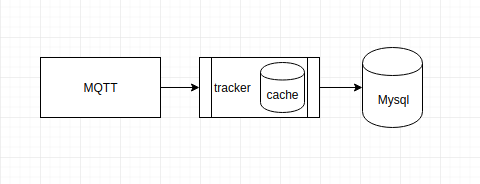

Tracker
=======
Driver position tracking to collect and store driver position in memory first and then persist them every `tracker.db.update-mysql-milliseconds-rate` second in mysql DB.



Configuration
-------------
```application.properties
spring.mysql.datasource.tracker.username=root
spring.mysql.datasource.tracker.password=root
spring.mysql.datasource.tracker.jdbc-url=jdbc:mysql://<TRACKER_DB_ADDRESS>:3306/<DB_NAME>

spring.mysql.datasource.bi.username=root
spring.mysql.datasource.bi.password=root
spring.mysql.datasource.bi.jdbc-url=jdbc:mysql://<BI_DB_ADDRESS>:3306/<DB_NAME>

spring.jpa.hibernate.naming.physical-strategy=org.hibernate.boot.model.naming.PhysicalNamingStrategyStandardImpl
spring.jpa.hibernate.ddl-auto=validate
spring.jpa.generate-ddl=true
spring.jpa.properties.hibernate.dialect=org.hibernate.spatial.dialect.mysql.MySQL56InnoDBSpatialDialect

tracker.mqtt.url=tcp://<URL_ADDRESS>
tracker.mqtt.username=<USER_NAME>
tracker.mqtt.password=<PASSWORD>
tracker.mqtt.connection-timeout=5

tracker.mqtt.location-topic=<MQTT_TOPIC>

tracker.cache.expire-time-milliseconds=10000

tracker.db.update-tracker-mysql.active=false
tracker.db.update-tracker-mysql-milliseconds-rate=1000
tracker.db.update-bi-mysql-milliseconds-rate=2000

```

API
---
|Type|Uri|Description|
|---|---|---|
|GET|`/v1/driver/near`|get driver ids that they near lat & lon|
|GET|`/v1/driver/location`|get all driver information if no driverId specified|

request sample
```bash
# Get all near online driver ids
# distance unit is kilometer
 
$ curl -XGET "localhost:8080/v1/driver/near?lat=35.7018057&lon=51.4254936&distance=0.2" 
```
response sample is like:
```json
["5bcec53924aa9a000149546e","5b6bd112a7b11b000186df23"]
```
---

request sample
```bash
# Get single driver lat and lon
 
$ curl -XGET "localhost:8080/v1/driver/location?driverId=5bcec53924aa9a000149546e" 
```
response sample is like:
```json
[{"id":"5bcec53924aa9a000149546e","lat":35.7055252,"lon":51.3799262}]
```

---

request sample
```bash
# Get all online drivers location
 
$ curl -XGET localhost:8080/v1/driver/location
```
response sample is like:
```json
[
  {"id":"5ced14b52ab79c000152eaa9","lat":35.7081011,"lon":51.3953885},
  {"id":"5b8a40e324aa9a0001335815","lat":35.7573133,"lon":51.4094223}
]
```